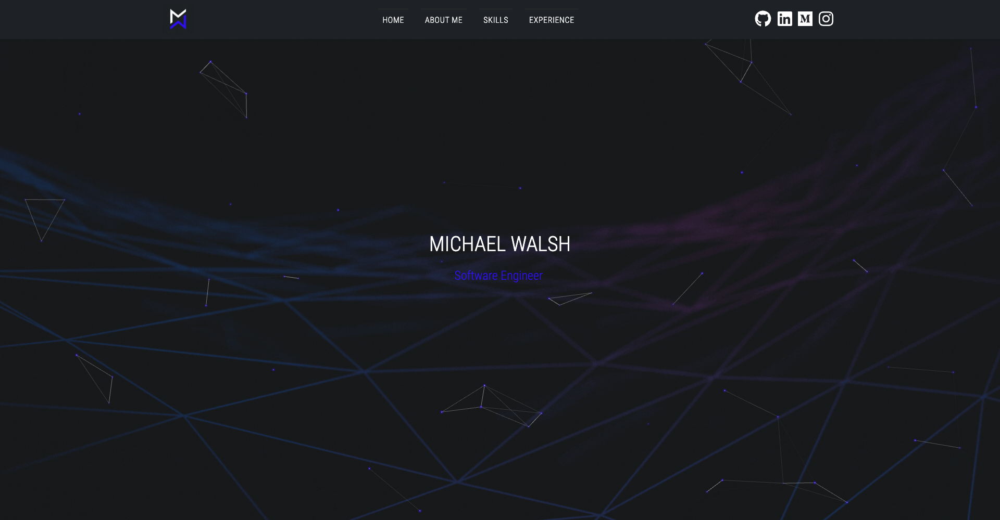
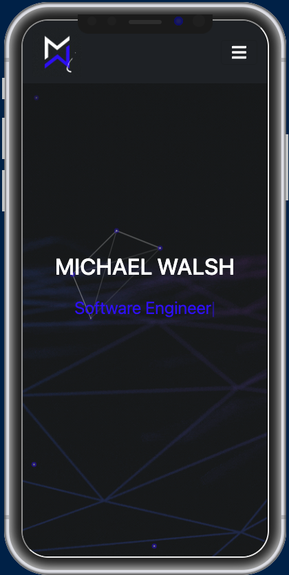

<h1> 
 ReactJS Web Portfolio 
 </h1>
<h3> 
 https://www.michael-walsh.dev/ 
 </h3>

<h2> 
 PC / Desktop View 
 </h2>

  

<h2> 
 Mobile View 
 </h2>

  

<h2> Project Information </h2>

 This GitHub repository is being used for building out my online web portfolio which has been created using React. At the moment this is a work in progress but I will continue to update the repository as progress is made. The aim of this portfolio is to provide an overview of my skillset, tech stack, and to outline my experience across a range of events throughout my career.
  

<h2> Technologies, Libraries, and Fonts Used </h2>

  - React
  - Bootstrap 5.0
  - FontAwesome
  - Google Fonts (Roboto Condensed)
